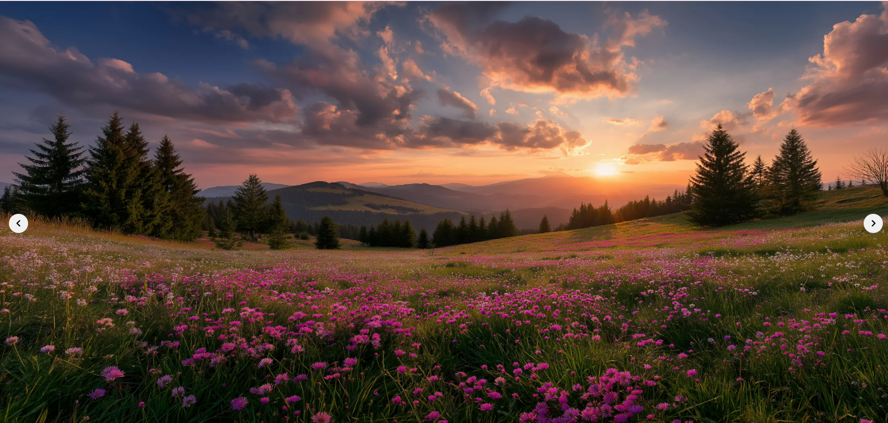

# 🎯Image Slider

This is a **Image Slider** project built using **HTML, CSS, and JavaScript**.

## ✒️ Language

- HTML

- CSS

- Java Script

## 📂 Project Structure

- <b>Image Slider Project</b>
   - index.html

   - style.css

   - script.js

   - <b>images</b>
      - img1.jpg
      - img2.jpg
      - img3.jpg
      - img4.jpg
      - img5.jpg
   

## 📸ScreenSort

## 🔗 Video Link

https://drive.google.com/file/d/1yP0bWdCg1bS5iWc-It8dONzPok6Ko0sU/view?usp=sharing

